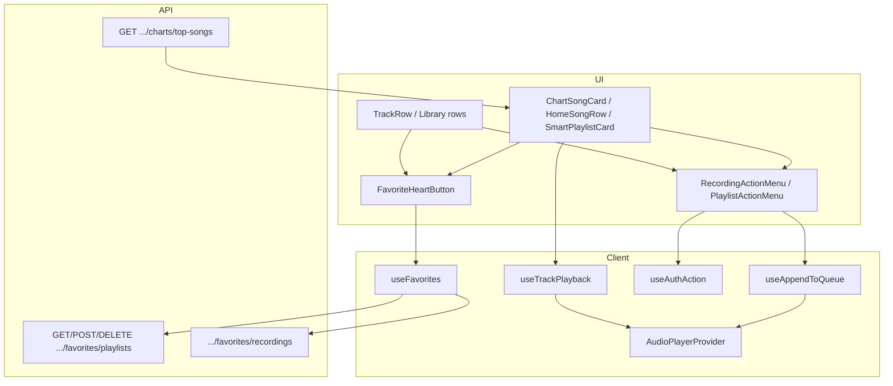

# Code review handoff — playback, media actions, favorites

**Branch:** `master`  
**Review range:** `caef96c` → `59fc519` (7 commits, committed)  
**Author context:** Homepage/player UX fixes, reusable ⋮ action menus, playlist favorites API + heart UI  
**Date:** 2026-05-28

---

## Executive summary

This batch fixes broken playlist deletion, unifies play/pause UI between homepage rows and the bottom player, adds site-wide **recording** and **playlist** action menus (queue · save · share / add-all · share), and ships **playlist favorites** (REST + hearts). Song favorites reuse the existing recording-favorites API; hearts are intentionally **outside** the ⋮ menu.

**Out of scope for these commits:** Large uncommitted work on analytics, library routes, seed expansion, and profile-view migration — see [Uncommitted / adjacent work](#uncommitted--adjacent-work).

---

## Commits to review

| Commit | Summary |
|--------|---------|
| `caef96c` | Fix playlist delete: SDK `unwrap()` accepts HTTP 204 (empty body) |
| `d130491` | Chart songs include `audioUrl`; homepage chart playback works without library lookup |
| `ed48234` | Remove loading spinner on homepage rows; show pause while playing |
| `7512463` | Shared `isPlaying` + `useTrackPlayback`; bottom player sync |
| `c246f02` | Media action menu components + homepage wiring |
| `3987216` | Menus on playlist pages, library, favorites, studio history |
| `59fc519` | Playlist favorites API + `FavoriteHeartButton` + hooks |

```bash
git log caef96c^..59fc519 --oneline
git diff caef96c^..59fc519 --stat
```

---

## Feature 1: Playlist delete 404

### Problem
`DELETE /api/v1/playlists/{id}` returned **204 No Content**. The SDK `unwrap()` treated empty success bodies as failure and surfaced an error; the UI retried and could hit **404**.

### Fix
`packages/client-sdk/src/api.ts` — `unwrap()` returns when `response.ok` (including 204), not only when `data` is truthy.

### Also touched (same era, may be in earlier commits)
- Studio playlist editor: owner check, 404-on-retry handling, error UI ordering.

### Review focus
- Confirm no regressions for endpoints that return JSON bodies on 2xx.
- Confirm `removeFavorite` / `playlists.delete` / other `.then(() => undefined)` 204 callers still behave.

---

## Feature 2: Homepage playback & play/pause sync

### Problem
- Chart/homepage songs lacked reliable `audioUrl`.
- Homepage row showed a loading spinner; bottom player and row could disagree on playing vs paused.

### Fixes

| Area | Change |
|------|--------|
| API | `TopSongItem.audioUrl` in OpenAPI + `src/routes/charts.ts` |
| Player | `AudioPlayerProvider`: derived `isPlaying = playing \|\| loading`; `onWaiting` only sets loading when audio is paused |
| Hook | `apps/web/src/hooks/useTrackPlayback.ts` — `isActive`, `isPlaying`, `isPaused` from context |
| UI | `BottomPlayer`, `ChartSongCard`, `HomeSongRow`, `TrackRow` use shared state |

### Review focus
- `useTrackPlayback` assumes `currentTrack.id` matches row `trackId` everywhere it is used.
- Optimistic `playing` after successful `audio.play()` — verify no stuck “playing” on failed loads.
- Chart vs library vs playlist row ID types (recording id vs composite keys).

---

## Feature 3: Media action menus

### UX contract

| Entity | ⋮ menu actions | Favorite |
|--------|----------------|----------|
| Recording (song) | Add to queue · Save to playlist · Share | Heart button (separate) |
| Playlist | Add all to queue · Share | Heart button (separate) |

- **Queue:** client-only via `AudioPlayerProvider.appendToQueue` (deduped in `useAppendToQueue`).
- **Save / queue / favorite:** require auth (`useAuthAction` → `/login` with `state.from`).
- **Share:** works for guests (`shareContent` — Web Share API or clipboard).

### New / central files

```
apps/web/src/components/media/
  MediaActionMenu.tsx       # ⋮ dropdown shell
  RecordingActionMenu.tsx   # song actions
  PlaylistActionMenu.tsx    # playlist actions
  FavoriteHeartButton.tsx   # heart (see Feature 4)

apps/web/src/hooks/
  useAppendToQueue.ts
  useAuthAction.ts

apps/web/src/lib/
  queueTrack.ts             # *ToQueueTrack helpers, share URL builders
  shareContent.ts
```

### Wired surfaces (committed)

- Homepage: `ChartSongCard`, `HomeSongRow`, `SmartPlaylistCard`
- Playlist detail: `TrackList` / `TrackRow` (via `playlistContext`), `CollectionView` share
- Library: `LibraryPage` rows
- Favorites: `PersonalTrackRow`, recommended `SmartPlaylistCard`
- Related playlists: `PlaylistPage`, `CanonicalPlaylistPage`, `PlaylistCard`
- Studio: `StudioHistoryPage`

### Review focus
- `queueTrack` mappers: every caller must pass valid `audioUrl` and playback context where analytics matter.
- `appendTracks` for “add all to queue” — order, dedup, empty playlist.
- Event propagation: menus/hearts use `stopPropagation` on cards that are also links/buttons.
- `AddToPlaylistDialog` only opened from menu “Save” — old inline “+” removed from `TrackRow`; confirm no dead entry points.
- Accessibility: `aria-label` on menu trigger; heart `aria-pressed`.

---

## Feature 4: Playlist favorites API + hearts

### Backend

**Routes** (`src/routes/me.ts`), all auth-required:

| Method | Path | Behavior |
|--------|------|----------|
| GET | `/api/v1/me/favorites/playlists` | Paginated list; `PlaylistSave` where `kind: FAVORITE` |
| POST | `/api/v1/me/favorites/playlists/{playlistId}` | Upsert save; 404 if playlist missing; 201 + body |
| DELETE | `/api/v1/me/favorites/playlists/{playlistId}` | `deleteMany`; **204** |

Storage: existing `PlaylistSave` model with `kind: "FAVORITE"` (same pattern as `RecordingSave` for songs).

**OpenAPI:** `FavoritePlaylistItem`, `FavoritePlaylistsResponse`, `FavoritePlaylistSavedResponse` in `openapi/openapi.yaml`.

**SDK:** `me.favoritePlaylists`, `addFavoritePlaylist`, `removeFavoritePlaylist` in `packages/client-sdk/src/api.ts` (regenerate types via `npm run openapi:types` if spec changes).

### Frontend

| File | Role |
|------|------|
| `hooks/useFavorites.ts` | Queries + toggle mutations; invalidates `["me","favorites",...]` |
| `components/media/FavoriteHeartButton.tsx` | `target: recording \| playlist`, `variant: overlay \| inline` |
| `pages/FavoritesPage.tsx` | Favorite playlists grid + shared hearts on song rows |

Hearts on: `ChartSongCard`, `HomeSongRow`, `SmartPlaylistCard`, `PlaylistCard`, `TrackRow`, `CollectionView` header.

### Review focus
- **204 handling** again on `removeFavoritePlaylist` (depends on Feature 1 fix).
- Favorite ID sets built from `pageSize: 100` — hearts may be wrong if user has >100 favorites until pagination is added.
- Guest clicks heart → login redirect (no silent no-op).
- `FavoriteHeartButton` does not gate on auth status for *display*; unfavorited state shows for guests until click.
- POST idempotency: upsert with empty `update` — confirm unique constraint `userId_playlistId_kind`.
- DELETE when not favorited: 204 anyway (`deleteMany`) — acceptable?

---

## Architecture diagram



---

## How to run & verify

### Build
```powershell
cd c:\wamp64\www\musicpop
npm run sdk:build
npm --prefix apps/web run build
```

### Backend (if testing API manually)
```powershell
npm run dev
# Swagger: http://localhost:4000/docs
```

### Manual test checklist

**Playlist delete**
- [ ] Studio: delete own playlist → succeeds, no false error
- [ ] Network tab: single DELETE, 204

**Playback**
- [ ] Homepage chart row: play → audio plays, row shows pause (not spinner)
- [ ] Bottom player play/pause toggles row icon on active track
- [ ] Switch tracks: previous row resets, new row active

**Recording menu**
- [ ] Guest: Share works; queue/save redirect to login
- [ ] Authed: Add to queue (toast “Added” / “Already in queue”)
- [ ] Authed: Save opens playlist dialog

**Playlist menu**
- [ ] Add all to queue on playlist with N tracks
- [ ] Share copies/opens URL

**Favorites**
- [ ] Authed: heart playlist on homepage → appears under Favorites → Favorite playlists
- [ ] Authed: heart song → appears in favorite recordings list
- [ ] Unheart removes from list after refetch
- [ ] DELETE favorite playlist returns 204; UI updates

---

## Suggested review order

1. `packages/client-sdk/src/api.ts` — `unwrap()` + new me methods  
2. `src/routes/me.ts` — favorites/playlists handlers  
3. `openapi/openapi.yaml` — schemas match implementation  
4. `apps/web/src/providers/AudioPlayerProvider.tsx` — `isPlaying`, waiting handler  
5. `apps/web/src/hooks/useTrackPlayback.ts` + one consumer (`ChartSongCard`)  
6. `apps/web/src/components/media/*` + `lib/queueTrack.ts`  
7. `apps/web/src/hooks/useFavorites.ts` + `FavoriteHeartButton.tsx`  
8. Integration pages: `FavoritesPage`, `TrackList` / `CollectionView`, `LibraryPage`

---

## Risks & open questions

| Risk | Notes |
|------|--------|
| Favorite list capped at 100 IDs client-side | Heart state wrong for power users; consider server “is favorited” or higher limit |
| Queue is ephemeral | Refresh clears queue; not persisted — by design |
| Duplicate favorites API patterns | Recording vs playlist saves are parallel; could share helper later |
| Chart `audioUrl` exposure | Ensure URLs are only for playable/public content |
| No automated tests in this batch | Manual checklist above is primary QA |

---

## Uncommitted / adjacent work

**Not in commits `caef96c`–`59fc519`.** Reviewer may see dirty tree:

- Analytics routes/hooks, library routes/hooks  
- Seed data expansion, profile-view migration  
- `src/lib/playlistHref.ts`, canonical URL hooks  
- Design/plan markdown, screenshots  

Do not block approval of the 7 commits on uncommitted files unless explicitly included in the PR scope.

---

## Key file index

| Topic | Paths |
|-------|--------|
| SDK unwrap / me API | `packages/client-sdk/src/api.ts` |
| OpenAPI | `openapi/openapi.yaml` |
| Me routes | `src/routes/me.ts` |
| Charts audioUrl | `src/routes/charts.ts` |
| Player | `apps/web/src/providers/AudioPlayerProvider.tsx` |
| Playback hook | `apps/web/src/hooks/useTrackPlayback.ts` |
| Menus | `apps/web/src/components/media/*.tsx` |
| Queue helpers | `apps/web/src/lib/queueTrack.ts`, `hooks/useAppendToQueue.ts` |
| Favorites | `hooks/useFavorites.ts`, `FavoriteHeartButton.tsx`, `pages/FavoritesPage.tsx` |
| List wiring | `TrackRow.tsx`, `TrackList.tsx`, `CollectionView.tsx`, `LibraryPage.tsx` |

---

## Prior handoff

Earlier backend→frontend scaffold notes: `HANDOFF_AGENT_B.md` (initial API surface; partially superseded by me/favorites/charts work above).

---

## Questions for reviewer

1. Is `pageSize: 100` for favorite ID sets acceptable for MVP, or should we add a lightweight `GET .../favorites/ids` endpoint?  
2. Should playlist favorite DELETE return 404 when not saved, or is idempotent 204 preferred?  
3. Any concern exposing `audioUrl` on chart/homepage payloads for non-public recordings?
