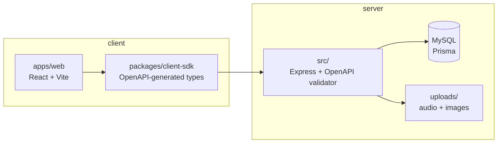

# Playlisted

**A music platform where playlists have opinions, artists have URLs, and the API contract is written down like an adult.**

Playlisted is a full-stack music discovery and creator app: editorial homepage rows, canonical playlist URLs (`/@username/slug`), a bottom player that actually stays at the bottom, creator **Studio** tools, charts, favorites, unified search, and an admin panel for the brave. One repo. One deploy. Zero mystery meat endpoints.

> *Folder on disk may say `musicpop`. The product says **Playlisted**. We contain multitudes.*

---

## What you get

| For listeners | For creators | For operators |
|---------------|--------------|---------------|
| Homepage discovery & charts | Upload audio & cover art | Admin dashboard |
| Search (songs, playlists, artists) | Collections & inbox playlists | Tags & homepage features |
| Favorites & library | Playback analytics | User / song / playlist moderation |
| Persistent bottom player + queue | Public profile & `/@user/slug` links | Role-based access (`ADMIN`, `EDITOR`, …) |

**Playlist types** include albums, mixes, podcast channels, and releases — because not everything is a 47-track “Chill Vibes” playlist (though we support that too).

---

## Architecture (the short tour)



**Contract-first:** `openapi/openapi.yaml` is the source of truth. Change the spec → regenerate the SDK → TypeScript yells if the UI lies. Beautiful.

**Production shape:** one Railway web service serves the API, static uploads, and built SPA; a separate Railway worker service drains queued subtitle jobs through Modal. Railway-ready via `railway.toml` for web and `railway.worker.toml` for the subtitle worker.

---

## Repo map

```
musicpop/                    # you are here
├── apps/web/                # React 19 SPA (Tailwind v4)
├── packages/client-sdk/     # Typed API client from OpenAPI
├── src/                     # Express API routes & libs
├── prisma/                  # Schema, migrations, seed data
├── openapi/openapi.yaml     # The sacred contract
├── railway.toml             # Web deploy config (build → migrate → start API)
└── railway.worker.toml      # Subtitle worker deploy config (build → start worker)
```

---

## Quick start (local)

**You need:** Node 22+, MySQL, and about five minutes.

```bash
# 1. Install
npm ci

# 2. Environment
cp .env.example .env
# Edit DATABASE_URL for your MySQL instance

# 3. Database
npm run prisma:migrate
npm run prisma:seed

# 4. Run API + web together
npm run dev:full
```

| URL | What |
|-----|------|
| http://localhost:5173 | Web app (Vite) |
| http://localhost:4000 | API |
| http://localhost:4000/docs | Swagger UI *(dev only)* |
| http://localhost:4000/api/v1/health | Health + DB probe |

**API-only:** `npm run dev`  
**Web-only:** `npm run web:dev` (proxies `/api` and `/uploads` to port 4000)

---

## Environment variables

Start with `.env.example`, then add service-specific values as needed.

### Core app

| Variable | Required | Notes |
|----------|----------|-------|
| `DATABASE_URL` | Yes | MySQL connection string. Railway MySQL sets this automatically. |
| `NODE_ENV` | Production | Use `production` on deployed services. |
| `PORT` | No | API port, defaults to `4000`. |
| `HOST` | No | Bind host, defaults to `0.0.0.0`. |
| `TRUST_PROXY` | Production | Set to `1` behind Railway/proxies. |
| `VITE_API_BASE_URL` | Split web/API only | Leave empty when the built SPA is served by the API. Set to the API origin for a separate frontend. |
| `CORS_ORIGIN` | Split web/API only | Frontend origin allowed to call the API. |
| `PUBLIC_SITE_URL` | Recommended | Canonical public site URL for share previews and absolute URLs. |
| `ENABLE_API_DOCS` | Optional | Set `1` to expose `/docs` and `/openapi.yaml` in production. |

### Google login and registration

| Variable | Required | Notes |
|----------|----------|-------|
| `GOOGLE_CLIENT_ID` | Yes, for Google auth | OAuth client ID from Google Cloud Console. |
| `GOOGLE_CLIENT_SECRET` | Yes, for Google auth | OAuth client secret from Google Cloud Console. |
| `WEB_APP_URL` | Production recommended | Public web app origin, e.g. `https://playlisted.com`. Used after Google redirects back. |
| `API_PUBLIC_URL` | Production recommended | Public API origin, e.g. `https://api.playlisted.com` or the same origin as the app. |
| `GOOGLE_REDIRECT_URI` | Optional | Override callback URL. Defaults to `${API_PUBLIC_URL}/api/v1/auth/google/callback` when `API_PUBLIC_URL` is set. |
| `GOOGLE_OAUTH_STATE_SECRET` | Recommended | HMAC secret for signed OAuth state. Falls back to `SESSION_SECRET`, then `GOOGLE_CLIENT_SECRET`. |
| `OAUTH_ALLOWED_WEB_ORIGINS` | Split web/API recommended | Comma-separated allowed frontend origins for OAuth return redirects. Localhost HTTP origins are allowed in dev. |

In Google Cloud Console, add this authorized redirect URI:

```text
https://your-api-or-app-origin.example.com/api/v1/auth/google/callback
```

For local split dev, the default callback is:

```text
http://localhost:4000/api/v1/auth/google/callback
```

### Uploads and media

| Variable | Required | Notes |
|----------|----------|-------|
| `UPLOADS_DIR` | No | Local upload directory, defaults to `uploads`. |
| `MEDIA_BASE_URL` | No | Public base path for local uploads, defaults to `/uploads`. |
| `STORAGE_PROVIDER` | Split services recommended | Set `r2` when web/API and workers need shared uploaded media. |
| `R2_ACCOUNT_ID`, `R2_ACCESS_KEY_ID`, `R2_SECRET_ACCESS_KEY`, `R2_BUCKET_NAME` | R2 only | Cloudflare R2 credentials. |
| `R2_PUBLIC_BASE_URL` or `UPLOADS_PUBLIC_BASE_URL` | R2 only | Public bucket/base URL for stored uploads. |

### Subtitles

| Variable | Required | Notes |
|----------|----------|-------|
| `SUBTITLES_PROVIDER` | Worker | `disabled`, `local-python`, `whisper`, or `modal`. Production worker expects `modal` unless explicitly overridden. |
| `SUBTITLES_ENABLED` | No | Set `false` to disable subtitle processing. |
| `SUBTITLES_WORKER_REQUIRE_MODAL` | Production worker | Set `true` to fail closed unless Modal is configured. |
| `SUBTITLES_MODAL_ENABLED`, `MODAL_SUBTITLES_URL`, `MODAL_SUBTITLES_TOKEN` | Modal worker | Required for Modal subtitle jobs. |
| `SUBTITLES_MODAL_DAILY_MAX_JOBS`, `SUBTITLES_MODAL_MONTHLY_BUDGET_CENTS`, `SUBTITLES_MODAL_MAX_AUDIO_SECONDS` | Modal worker | Optional cost and duration guardrails. |
| `OPENAI_API_KEY` | Whisper provider only | Used by the OpenAI Whisper subtitle provider. |

---

## Scripts worth knowing

| Command | Does |
|---------|------|
| `npm run dev:full` | API + web, ports cleared first (Windows-friendly) |
| `npm run ci` | What GitHub Actions runs — run before you PR |
| `npm run build:prod` | Prisma generate + API compile + web production build |
| `npm run openapi:types` | Regenerate SDK types from OpenAPI |
| `npm run prisma:seed` | Load demo artists, playlists, and drama |
| `npm run prisma:backfill-subtitles` | Dry-run manual subtitle queue backfill |
| `SUBTITLES_BACKFILL_CONFIRM=QUEUE_SUBTITLES npm run prisma:backfill-subtitles -- --apply` | Explicitly enqueue existing uploaded songs for subtitle work |

---

## Production (Railway)

We ship as two app services plus MySQL: web/API and subtitle worker.

1. Connect this repo to [Railway](https://railway.app).
2. Add the **MySQL** plugin and link `DATABASE_URL`.
3. Set variables:

   | Variable | Value |
   |----------|--------|
   | `NODE_ENV` | `production` |
   | `TRUST_PROXY` | `1` |
   | `VITE_API_BASE_URL` | *(leave empty for same-origin)* |

4. **Mount a volume** at `/app/uploads` on the web service if you care about audio surviving redeploys. (Ephemeral disk is a vibe until it isn’t.)
5. Add a second Railway service from the same repo for subtitles. Use `railway.worker.toml` or set its start command to `npm run subtitles:worker:prod`.

Web deploy pipeline: `build:prod` → `prisma migrate deploy` (release) → `node dist/server.js`. Health check: `/api/v1/health`.

Subtitle worker pipeline: `build:prod` → `node dist/workers/subtitleWorker.js`. It does not run migrations, does not backfill on startup, and does not expose an HTTP API. In production it requires `SUBTITLES_PROVIDER=modal` unless explicitly overridden.

For split Railway services, set `STORAGE_PROVIDER=r2` on the web/API service so new uploads are stored as public R2 URLs. The subtitle worker can then download those URLs from its own service container before posting audio to Modal.

Backfill is manual only. Startup may reset stale `PROCESSING` rows and process existing `QUEUED` rows; upload/create paths are responsible for creating new `QUEUED` subtitle rows.

`/docs` and `/openapi.yaml` are **off in production** unless you set `ENABLE_API_DOCS=1`. Security is also a feature.

---

## Roles & rules

- **LISTENER** — default on register. Listen, favorite, collect.
- **CREATOR** — studio uploads, collections, analytics.
- **EDITOR** / **ADMIN** — moderation and homepage surgery.

Registration always creates `LISTENER` users. No, you cannot `POST /register` with `"role": "ADMIN"`. We’ve been on the internet before.

---

## Tech stack

- **Frontend:** React 19, React Router 7, TanStack Query, Tailwind CSS v4, Vite 6
- **Backend:** Express 4, express-openapi-validator, Multer uploads
- **Data:** Prisma 6 + MySQL
- **Auth:** Bearer sessions (hashed tokens, 30-day TTL)
- **Tooling:** TypeScript, OpenAPI TypeScript, tsup (SDK), GitHub Actions CI

---

## Contributing

```bash
npm run ci
```

If it passes locally, you’re probably fine. If it fails, the OpenAPI spec and you have a disagreement — fix the spec first, then the code, then your pride.

1. Branch from `master`
2. Keep changes focused
3. Regenerate SDK types when you touch `openapi/openapi.yaml` (`npm run openapi:types`)
4. Open a PR

---

## License

Private project (`package.json` → `"private": true`). If you’re reading this on GitHub, you probably already know the deal.

---

<p align="center">
  <strong>Playlisted</strong><br />
  <em>Put a song on it. Put a slug on it. Ship it.</em>
</p>
