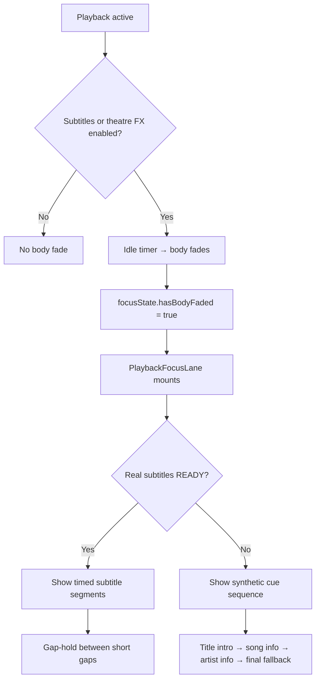

# Playback Focus & Subtitle Display

**Status:** Current  
**Scope:** Client-side cinematic playback UI — body fade, focus lane, timed subtitles, synthetic cues.  
**Pipeline (generation):** see [`subtitles-pipeline.md`](./subtitles-pipeline.md).

---

## Overview

During playback, Playlisted can fade away page chrome and show a centered **focus lane** with subtitles and track metadata. This system is separate from theatre FX (background visuals) but shares timing constants and coordinates through `playbackFocusTiming.ts`.



---

## Gating: when the focus lane appears

The focus lane only renders when **all** of these are true:

1. `playFocusActive` — playback is running (site player or radio)
2. `hasBodyFaded` — page body chrome has faded (`usePlaybackFocusBody`)
3. `isPlaying` — transport is not paused
4. A resolved fixture is not `{ type: 'none' }`

Body fade itself requires at least one of **subtitles enabled** or **theatre FX enabled** (`getPlaybackFocusBodyFadeSuppressed`). If both are off, cinematic mode does not activate.

Body fade is also disabled on certain routes (admin, chat, settings, search, login, owner's profile page) — see `playbackFocusBodyFade.ts`.

---

## Core modules

| Path | Role |
|------|------|
| `lib/playbackFocusTiming.ts` | All fade/delay constants + CSS var export |
| `lib/playbackFocus/types.ts` | `PlaybackFocusFixture`, `PlaybackFocusState`, cue types |
| `lib/playbackFocus/resolvePlaybackFocusFixture.ts` | Priority resolver: real subtitles → synthetic → final fallback |
| `lib/playbackFocus/buildSyntheticCues.ts` | Builds title/artist/song-info cue timeline |
| `lib/playbackFocus/focusLaneSequence.ts` | Sequence window math from timing constants |
| `lib/playbackFocus/subtitleGapHold.ts` | Holds previous cue through short inter-cue gaps |
| `hooks/useFocusLanePlayback.ts` | Unified track/time for site player vs radio |
| `components/app-shell/hooks/usePlaybackFocusBody.ts` | Body fade timers, `PlaybackFocusState` producer |
| `components/app-shell/hooks/usePlaybackFocusTrack.ts` | `playFocusActive` from player state |
| `components/app-shell/PlaybackFocusLane/` | Portal UI, visibility, subtitle rendering |

---

## Timing constants

All values live in `playbackFocusTiming` (`apps/web/src/lib/playbackFocusTiming.ts`):

### Body fade

| Key | Default | Purpose |
|-----|---------|---------|
| `body.delayMs` | 5000 | Idle before body fades out |
| `body.restoreDelayMs` | 6000 | Idle before body restores on activity |
| `body.fadeOutMs` | 2000 | Body opacity transition |

### Focus lane (real subtitles)

| Key | Default | Purpose |
|-----|---------|---------|
| `focusLane.delayMs` | 0 | CSS delay before subtitle appears |
| `focusLane.fadeInMs` | 200 | Subtitle fade-in |
| `focusLane.fadeOutMs` | 450 | Subtitle fade-out |
| `focusLane.exitBufferMs` | 180 | Extra hold after fade-out before unmount |

### Synthetic sequence

| Key | Default | Purpose |
|-----|---------|---------|
| `titleIntro.delayMs` | 0 | Title intro start offset |
| `titleIntro.minVisibleMs` | 6000 | How long title intro shows |
| `titleIntro.fadeInMs` / `fadeOutMs` | 900 / 650 | Title intro transitions |
| `artistVisual.gapAfterTitleIntroMs` | 0 | Gap between title end and next cue |
| `fallbackSubtitle.gapAfterArtistMs` | 15000 | Gap before final song-title fallback |
| `fallbackSubtitle.maxVisibleMs` | 5000 | Duration of song-info and artist-info cues |
| `fallbackSubtitle.fadeInMs` / `fadeOutMs` | 900 / 650 | Fallback cue transitions |

### Subtitle flow

| Key | Default | Purpose |
|-----|---------|---------|
| `subtitleFlow.minGapForArtistVisualMs` | 2000 | Gaps shorter than this keep the previous real subtitle visible |

### Theatre overlay (related, not focus lane)

| Key | Default | Purpose |
|-----|---------|---------|
| `theatre.fadeInMs` / `fadeOutMs` | 1200 / 3200 | Theatre overlay opacity — see [`theatre-runtime.md`](./theatre-runtime.md) |

`playbackFocusUserActivityEnabled` is currently `false` — pointer/keyboard activity does not reset the body fade timer.

---

## Fixture resolution priority

`resolvePlaybackFocusFixture()` returns one of:

| Type | When |
|------|------|
| `subtitle` | Real `RecordingSubtitle` segments are `READY`, subtitles toggle is on, and current time matches a segment (or gap-hold applies) |
| `fallbackSubtitle` | No active real subtitle; synthetic cue is active (title-intro, song-info, artist-info) |
| `finalFallback` | Past `fallbackStart` window with no other content — shows song title + artist name |
| `none` | Gating failed or nothing to show |

**Real subtitles always win** when ready. Synthetic cues use **focus-lane elapsed time** (ms since body faded), not raw track time:

```ts
focusLaneElapsedMs = currentTimeMs - bodyFadedAtTrackMs
```

This keeps the title intro aligned to when the cinematic view opens, not track position 0.

### Synthetic cue timeline

Built by `buildSyntheticSubtitleCues(recording)`:

1. **title-intro** — `recording.title`, from `titleStart` to `titleEnd`
2. **song-info** — playlist/type/genre line, starts at `fallbackStart`
3. **artist-info** — owner/uploader line, after song-info window
4. **finalFallback** fixture — song title card after all synthetic windows (handled in resolver, not as a cue)

Windows are computed in `getFocusLaneSequenceWindows()` from `titleIntro` and `artistVisual` timing.

### Gap hold (real subtitles)

When two subtitle segments have a gap shorter than `minGapForArtistVisualMs`, the previous segment stays visible through the gap instead of flashing empty. Implemented in `resolveSubtitleSegmentAtTime()`.

---

## Site player vs radio

`useFocusLanePlayback()` picks the active source:

- **Site player** — `currentTrack` + `usePlaybackTransport().currentTime`
- **Radio** — `nowPlaying` + `audioRef.currentTime`, with `getRadioSeekTime()` fallback when audio hasn't seeked yet

The focus lane works for both, but subtitle fetch only runs when `recording.id` is available and subtitles are enabled.

---

## Subtitle fetch and polling

`PlaybackFocusLane` uses React Query:

```ts
queryKey: ["subtitles", recordingId, accessToken ? "auth" : "guest"]
queryFn: fetchRecordingSubtitles(recordingId, accessToken)
```

Polling (`refetchInterval: 3000ms`) continues while status is `QUEUED` or `PROCESSING`, up to 20 attempts (~1 minute), then stops to avoid polling for an entire track.

User toggle: `useSubtitleDisplay()` reads/writes `localStorage` key `playlisted:subtitles-enabled`.

---

## Visibility and CSS classes

`useFocusLaneVisibility()` manages mount/unmount with fade-out buffer from `getFixtureFadeOutMs()`. Variant CSS classes on `.focus-lane`:

| Class | Fixture |
|-------|---------|
| `focus-lane--subtitle` | Real subtitle |
| `focus-lane--title-intro` | Title intro synthetic cue |
| `focus-lane--artist-visual` | Song-info, artist-info, final fallback |
| `focus-lane--fallback` | Generic fallback styling |

Subtitle position (`top` / `middle` / `bottom`) comes from per-recording style; artist-visual fixtures force `middle`.

---

## Suppression hooks

| Mechanism | Purpose |
|-----------|---------|
| `usePlaybackFocusSuppressed()` | Global suppression (e.g. subtitle editor modal open) |
| `playbackFocusSuppression` module | Event-based suppress/unsuppress |
| `getPlaybackFocusBodyFadeConfig(pathname)` | Route-based body fade disable |

---

## Tests

| File | Covers |
|------|--------|
| `resolvePlaybackFocusFixture.test.ts` | Fixture priority, gating |
| `subtitleGapHold.test.ts` | Gap-hold logic |

---

## Related docs

- [`subtitles-pipeline.md`](./subtitles-pipeline.md) — API, worker, Modal generation
- [`theatre-runtime.md`](./theatre-runtime.md) — theatre FX (separate visual layer)
- [`theatre-animations.md`](./theatre-animations.md) — animation authoring
