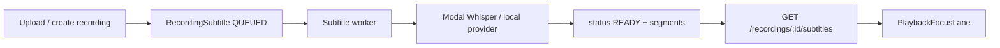

# Subtitles Pipeline

**Status:** Current  
**Scope:** Server-side subtitle generation, storage, API, and client consumption.  
**Client display:** see [`playback-focus.md`](./playback-focus.md).

---

## Overview

Subtitles are generated asynchronously after audio upload. The web API queues jobs; a separate worker service transcribes audio and stores timed segments. The React client fetches segments and renders them in the playback focus lane.



---

## Data model

`RecordingSubtitle` (Prisma) — one or more rows per recording:

| Field | Notes |
|-------|-------|
| `status` | `QUEUED` → `PROCESSING` → `READY` \| `FAILED` |
| `segments` | JSON array of `{ start, end, text }` (seconds) |
| `vttText` | WebVTT fallback; segments derived if JSON empty |
| `isActive` | Preferred row when multiple exist |
| `source` | e.g. `WHISPER` for manual/provider attribution |

`Recording.subtitlesDisabled` — when true, API returns `{ status: 'DISABLED' }` and no generation is attempted.

---

## When jobs are queued

`isSubtitleGenerationEnabled()` returns true when `SUBTITLES_ENABLED !== 'false'` and `SUBTITLES_PROVIDER !== 'disabled'`.

QUEUED rows are created on:

- Recording create (`src/routes/recordings.ts`)
- Upload flows (`src/routes/uploads.ts`)
- Ingest updates when audio changes (`src/routes/ingest/recordings.ts`)

**Web/API must not run transcription in production.** Railway web keeps `SUBTITLES_PROVIDER=disabled`; it only queues rows.

**Admission control** on `POST /api/v1/ingest/recordings` (the endpoint that actually creates `QUEUED` rows): rate-limited (`ingestRecordingsLimiter`), plus a per-account and a system-wide cap on in-flight `QUEUED` rows (`SUBTITLES_MAX_QUEUED_PER_ACCOUNT`, `SUBTITLES_MAX_QUEUED_SYSTEM`) — `429` past either. This bounds total pending paid work regardless of how many times one uploaded asset is reused across different `externalId`s. Retries with the same `(uploaderId, externalSource, externalId)` update the existing recording/job in place rather than minting a new one.

---

## Worker service

**Entry:** `npm run subtitles:worker:prod`  
**Source:** `src/workers/subtitleWorker.ts`  
**Deploy:** separate Railway service via `railway.worker.toml`

### Loop

1. `failStaleProcessingRows()` — rows stuck in `PROCESSING` past staleness window → `FAILED` (a worker died mid-job; this is the only "stale" case)
2. Claim oldest `QUEUED` row (`QUEUED` → `PROCESSING`, atomic `updateMany`)
3. Prepare audio file from recording URL
4. For the Modal provider: check the provider isn't paused, check today's/this month's audio-duration budget has room, then reserve this job's duration against it (pessimistically — reserved before the call, never refunded)
5. `runSubtitleProvider()` — Modal, local-python, or whisper
6. Write `segments`, `vttText`, `status: READY` or `FAILED`

**Content outcomes are one-shot:** `READY`/`FAILED` for a specific file (bad audio, no segments produced, a 400/413/422 from Modal) never revert — that reflects the file, not the provider, and is never retried.

**Provider-level outcomes return the row to `QUEUED` instead of failing it** — this is the MVP cost-containment design (subtitle availability is sacrificed for spend safety, not the other way around):
- Modal auth/billing/rate-limit/5xx/network/timeout failure → job stays `QUEUED`, the worker pauses all further Modal calls for `SUBTITLES_PROVIDER_FAILURE_COOLDOWN_MS` (`SubtitleProviderPause` table, persisted so a redeploy doesn't immediately resume mid-cooldown)
- Daily or monthly audio-duration ceiling reached → job stays `QUEUED`, worker stops claiming further work until the ceiling clears

**This is not a retry subsystem.** There are no retry counters, no backoff schedule, no attempt limits. A provider-level failure simply leaves the row in its normal `QUEUED` state — nothing distinguishes it from a row that was never attempted. It may naturally get claimed again on a later poll once the pause/cap clears, the same way any `QUEUED` row would, but nothing tracks or schedules that as a "retry." Concurrency is intentionally 1.

### Key environment variables

| Variable | Purpose |
|----------|---------|
| `SUBTITLES_PROVIDER` | `modal` (prod), `local-python`, `whisper`, or `disabled` |
| `SUBTITLES_ENABLED` | Master enable for queueing + worker |
| `SUBTITLES_WORKER_REQUIRE_MODAL` | Enforce Modal in production |
| `SUBTITLES_WORKER_SLEEP_MS` | Poll interval between jobs (default 10000) |
| `SUBTITLES_MAX_AUDIO_SECONDS` | Per-file duration cap (default 900) |
| `SUBTITLES_WHISPER_MODEL` | Model name passed to provider |
| `MODAL_SUBTITLES_URL` | Modal endpoint |
| `MODAL_SUBTITLES_TOKEN` | Shared bearer secret |
| `SUBTITLES_MAX_AUDIO_SECONDS_PER_DAY` | Global daily audio-duration ceiling (default 3600) |
| `SUBTITLES_MAX_AUDIO_SECONDS_PER_MONTH` | Global monthly audio-duration ceiling (default 18000) |
| `SUBTITLES_PROVIDER_FAILURE_COOLDOWN_MS` | Pause length after a provider-level failure (default 21600000 / 6h) |
| `SUBTITLES_MAX_QUEUED_PER_ACCOUNT` | Admission cap, web service (default 10) |
| `SUBTITLES_MAX_QUEUED_SYSTEM` | Admission cap, web service (default 50) |
| `SUBTITLES_PROCESS_AFTER` | Backlog cutoff — only claims rows whose `Recording.createdAt` is on/after this timestamp. Unset = no cutoff. |

These duration ceilings are an internal backstop, not the primary safety net — **Modal's own workspace/environment spend budget is the real hard-dollar limit.** Set the ceilings above deliberately well below whatever Modal's actual free-credit allowance is; the gap is the buffer against inaccuracy in this accounting, not a substitute for the Modal-side cap.

### Backlog policy: no recovery, cost-safe pipeline starts from a cutover

MVP policy is deliberately "forget the backlog" rather than drain it — subtitles are non-critical, and draining an old backlog right when the cost-safe worker turns on is exactly the scenario the whole redesign exists to avoid. Two mechanisms enforce this together:

1. **One-time exclusion** — `npm run subtitles:maintenance -- exclude-backlog --apply` marks every currently `QUEUED`/`PROCESSING` row `FAILED`, permanently, once, right before the Modal worker is enabled. Not a routine command; see its `--help` text.
2. **Ongoing guard** — `SUBTITLES_PROCESS_AFTER=<timestamp>` on the worker restricts claims to `Recording.createdAt >= timestamp`. This is the belt to (1)'s suspenders: even if a pre-cutover row somehow ends up `QUEUED` again (e.g. a re-queue from an audio change on an old recording), the worker still won't touch it. A row excluded this way is never marked `FAILED` by the guard itself — it's simply never claimed, and stays invisibly `QUEUED` forever unless someone runs `exclude-backlog` again.

Recommended cutover sequence, in order: disable the worker → deploy the migration/code → run `exclude-backlog --apply` → set `SUBTITLES_PROCESS_AFTER` to the cutover time → confirm Modal has its own hard workspace/environment spend budget configured (the actual financial backstop) → enable the worker. From then on, subtitle spend only ever belongs to recordings created after the cutover.

See [`railway-go-live.md`](./railway-go-live.md) for full Railway setup and [`modal/README.md`](../modal/README.md) for Modal deploy.

---

## API

### `GET /api/v1/recordings/:recordingId/subtitles`

Returns subtitle status and payload for the active row.

| Status | Response |
|--------|----------|
| `MISSING` | No subtitle row exists |
| `DISABLED` | `recording.subtitlesDisabled` |
| `QUEUED` / `PROCESSING` | Job in flight (client polls) |
| `READY` | `segments`, `vttText`, style fields |
| `FAILED` | Generic error for viewers; raw error for uploader/admin |

Stale `QUEUED`/`PROCESSING` rows are failed at read time via `failSubtitleIfStale()` (same staleness window as worker).

Access is gated by recording and playlist visibility (`canViewerAccessRecording`, `canViewerAccessPlaylist`).

### Transcript editing

`src/routes/transcripts.ts` — CRUD for manual transcript upload/edit. Validates timed cue format. Respects `subtitlesDisabled`.

### Recording patch

`PATCH /recordings/:id` accepts `subtitlesDisabled` to toggle per-recording subtitle display.

---

## Client consumption

**Fetch:** `apps/web/src/lib/subtitles.ts` → `fetchRecordingSubtitles(recordingId, accessToken)`

**Display:** `PlaybackFocusLane` polls while `QUEUED`/`PROCESSING`, then passes `segments` to `resolvePlaybackFocusFixture()`.

**User toggle:** `subtitleDisplay.ts` — `playlisted:subtitles-enabled` in localStorage.

**Events:**

| Event | Purpose |
|-------|---------|
| `playlisted:recording-subtitles-disabled-changed` | Invalidate cache when uploader toggles subtitles |
| `playlisted:recording-subtitle-style-changed` | Position/style update |

**Style:** per-recording `subtitlePosition` and `subtitleStyleId`; custom styles via `useRecordingSubtitleStyle`.

---

## Backfill (manual only)

Never runs on deploy. For existing recordings missing subtitle rows:

```bash
# Dry run
npm run prisma:backfill-subtitles

# Queue eligible rows
SUBTITLES_BACKFILL_CONFIRM=QUEUE_SUBTITLES npm run prisma:backfill-subtitles -- --apply

# Re-queue failed
SUBTITLES_BACKFILL_CONFIRM=QUEUE_SUBTITLES npm run prisma:backfill-subtitles -- --failed --apply
```

Only queues local `/uploads/...` URLs and URLs under configured public base URLs.

---

## Segment format

```ts
type SubtitleSegment = {
  start: number;  // seconds
  end: number;    // seconds
  text: string;
};
```

VTT is stored for download/export (`downloadRecordingTranscript`). API prefers JSON `segments`; falls back to parsing `vttText` if segments array is empty.

---

## Related docs

- [`playback-focus.md`](./playback-focus.md) — focus lane, synthetic cues, timing
- [`railway-go-live.md`](./railway-go-live.md) — deploy env vars
- [`modal/README.md`](../modal/README.md) — Modal POC deploy
