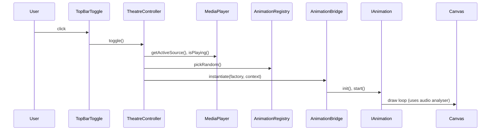

# Theatre Mode — Architecture Proposal

## Overview

Add a fullscreen "Theatre Mode" that overlays the site-wide media player with immersive, branded visuals. Theatre Mode is designed as a premium listening room: artwork-first, calm, and curated — not a generic visualizer. The initial scope includes a top-bar toggle button (disabled when no audio is playing), a `TheatreController` that manages a fullscreen branded container, and a scene-presets registry that pairs layered visuals (artwork, canvas effects, video) with run/preset semantics. Admin controls allow selecting or locking scene presets.

## Goals

- Give users a visually-rich, fullscreen media experience tied to the global audio player.
- Provide a clean bridge to the animation factory so new animations plug in easily.
- Support audio-reactive canvas animations, video backgrounds, and image slides/hybrid scenes.
- Keep the toggle button disabled when nothing is playing; allow admin overrides.
- Prototype: bold speaker effect, spinning amplitude effect, video prototype, imagery prototype. Default presets are calm/classy low-motion scenes; flashier visuals are opt-in.

## UX and UI

- Top bar: add a single icon button `Theatre` to toggle mode on/off.
- Button state:
  - Disabled when `mediaPlayer.isPlaying === false` and no admin override.
  - Enabled when playback is active.
  - Shows `active` state when Theatre Mode is on.
- Entry behavior:
  - Switch to a dedicated fullscreen container layered above app content.
  - Mute or route audio behavior should remain unchanged; visuals only.

# Integration with Site-wide Media Player

- Theatre Mode relies on a small public API from the media player (existing site-wide player):

  - `getActiveSource(): string | null` — returns active audio/video src URL or null.
  - `isPlaying(): boolean` — boolean playing flag.
  - `onStateChange(fn): () => void` — subscribe to playback state and metadata changes.

  Additionally Theatre Mode will read media metadata (artwork URL, title, artist) and prefer an artwork-first presentation. The controller optionally accepts an `HTMLAudioElement` or `MediaElement`/analyser to enable audio-reactive layers.

- The theatre module registers a listener and updates UI accordingly; button disabled when `isPlaying()` is false.

# Component Layout

- `TopBarToggle` (UI)
  - Reads `isPlaying()` and `isTheatreEnabled` (admin) to decide disabled state.
  - Tooltip and accessible label explain that the room is disabled when no playback is active.
  - Calls `TheatreController.toggle()`.

- `TheatreController` (singleton)
  - `enter()` / `exit()` / `toggle()`
  - Maintains `activeAnimation` and `activeMediaSrc`.
  - Subscribes to media player state via `onStateChange`.
  - Responsible for creating/removing the fullscreen container and handing it to the animation bridge.


- `AnimationBridge` (adapter)
  - Adapter that maps animation factory instances (or scene components) into the theatre container lifecycle.
  - Responsibilities:
    - Instantiate scene layers from a `ScenePreset` via the `SceneRegistry` and wire them into the theatre container.
    - Start, pause, resume, and stop scene layers while enforcing `runToEnd` or preset timing.
    - Provide lifecycle guarantees: init -> start -> (optional runToEnd) -> stop -> destroy.

- `AnimationFactory` (existing pattern)
  - Remains the canonical place to create animation instances; the bridge should reuse it.

## Scene & Animation Contracts

We shift from stand-alone animations to layered `ScenePreset`s. A `ScenePreset` is composed of named layers (background image/video, artwork, canvas effects, overlays). Each visual layer implements the `IAnimation` contract below so the bridge can orchestrate them consistently.

### IAnimation

Define a small interface for animations so all implementations are consistent:

- `init(container: HTMLElement, context: AnimationContext): Promise<void>` — prepare DOM/canvas.
- `start(): Promise<void>` — start the animation loop or timed sequence.
- `pause(): void`
- `resume(): void`
- `stop(): Promise<void>` — stops and cleans resources; if `runToEnd` is true, resolves after completion.
- `destroy(): void`

`AnimationContext` contains:
- `audioElement?: HTMLAudioElement` (or AnalyserNode)
- `mediaSrc?: string`
- `artworkUrl?: string`
- `metadata?: { title?: string; artist?: string }`
- `options?: Record<string, any>`
- `signals?: AbortSignal` for lifetime


## Scene Registry (ScenePreset)

Replace the earlier random animation registry with a `SceneRegistry` that registers named `ScenePreset`s. A `ScenePreset` groups layers and metadata and is the unit the bridge instantiates.

Registry entry fields:

- `id: string`
- `label: string`
- `factory: (ctx: SceneContext) => ScenePreset` — builds the layered scene
- `type: 'calm' | 'dynamic' | 'hybrid'`
- `runToEnd?: boolean`
- `weight?: number` — used for background rotation when not admin-locked

Example TypeScript types:

```ts
type SceneLayer = { id: string; type: 'image'|'video'|'canvas'|'ui'; factory: (ctx: AnimationContext) => IAnimation };
type ScenePreset = { id: string; label: string; layers: SceneLayer[]; runToEnd?: boolean; meta?: any };
```

Runtime behavior:
- On theatre entry, `AnimationBridge` asks the `SceneRegistry` for a preset (admin-selected or weighted random among calm defaults) and instantiates layers.
- Default rotation favors `calm` typed presets with low-motion animations; admin can select `dynamic` presets.
- If `runToEnd` is true, the bridge waits for the preset to complete before transitioning.

Example shape (TypeScript):

```ts
type RegistryEntry = {
  id: string
  label: string
  factory: (ctx: AnimationContext) => IAnimation
  type: 'canvas' | 'video' | 'image' | 'hybrid'
  runToEnd?: boolean
  weight?: number
}
```

Runtime behavior:
- On theatre entry, `AnimationBridge` asks the `AnimationRegistry` for a random entry (weighted) and instantiates it via the factory.
- If `runToEnd` is true, the bridge waits for `stop()` to resolve before choosing the next animation.
- Allow admin-selected registry seed or explicit animation selection via controls.

## Prototype Scenes & Visuals (brief)

1) Speaker Room Scene (Canvas + artwork)
- Artwork-first: large centered artwork (blurred background), title/artist, subtle pulse tied to low-frequency energy.
- Big speaker motif is a focused canvas layer that provides tasteful bass-reactive pulses and radial glow.
- Runs as a calm, timed scene with soft transitions; supports `runToEnd` for intro/outro.

2) Spinning Amplitude Layer
- A canvas layer with rotating rings/arcs that gently respond to mid/high frequencies; low visual intensity by default.
- Runs indefinitely; part of hybrid scenes where artwork remains central.

3) Video Background Scene
- Muted background loop or curated clip behind blurred artwork and canvas overlay.
- Video plays with safe bandwidth heuristics and lazy-loading.

4) Imagery / Slideshow Scene
- Crossfading artwork or curated images with parallax and subtle motion; canvas particles optional and low-intensity.

All prototypes should default to low-motion, respect `prefers-reduced-motion`, and include an artwork-first layout.


## Background Layer Concept

- Reintroduce the background layer as an explicit z-layer inside the theatre container. Layers (bottom → top):
  1. Background imagery / video
  2. Canvas-based audio-reactive animations
  3. Artwork (centered, blurred background)
  4. UI overlays / captions (title/artist, controls)

- Scene presets declare which layers they require; the bridge prepares fallbacks when a layer fails to initialize.


## Admin Controls

- Add admin-only control panel (behind `requireAdmin`) that can:
  - Toggle Theatre Mode globally on/off
  - Pick/lock a `ScenePreset` or reserve a playlist of presets
  - Adjust global animation parameters (max particle count, frame budget, safe-mode lowering effects)
  - Set default behavior for reduced-motion or low-power fallbacks
- Admin toggles persist via existing site settings store.

## Data Flow (sequence)



## API & Events

- `mediaPlayer.onStateChange` events:
  - `{ playing: boolean, src?: string, metadata?: {} }`
- `TheatreController.events`:
  - `enter`, `exit`, `animationChanged`, `error`


## Performance, Accessibility & Security Considerations

- Throttle draw loops to a configured FPS (default 60, admin-adjustable).
- Respect `prefers-reduced-motion`, safe-mode settings and `prefers-reduced-data` heuristics.
- Provide graceful fallbacks for failures (see next section).
- Limit canvas backing store and downscale visuals on low-power devices; make frame budget adjustable.
- Only load heavy video assets when user has sufficient bandwidth; lazy-load and defer non-essential layers.
- Sanitize remote imagery URLs, apply CORS checks, and avoid executing remote scripts in scenes.


## Implementation Plan & Milestones

1. Add `TopBarToggle` component wired to `TheatreController` and media player state.
2. Implement `TheatreController` + fullscreen branded container and lifecycle.
3. Implement `AnimationBridge` that instantiates `ScenePreset`s and enforces `runToEnd` semantics.
4. Implement `SceneRegistry` with preset metadata and weighted chooser; seed with calm presets.
5. Build prototype scenes (speaker room, spinAmp layer, video background, imagery scene).
6. Add admin panel controls, presets locking, and persistence.
7. Add demo page, unit tests for `TheatreState`, integration tests for button enable/disable, and profile performance on desktop and mobile.

## Formal Theatre State

Introduce a formal `TheatreState` shape for predictable UI and testing. Example:

```ts
type TheatreState = {
  active: boolean; // theatre mode on/off
  presetId?: string | null; // locked preset or null for auto
  canEnter: boolean; // whether mediaPlayer.isPlaying or admin override
  mediaSrc?: string | null; // current active source
  artworkUrl?: string | null;
}
```

UI components should read from this centralized state (and subscribe to changes) to simplify testing and assertions.
- Throttle draw loops to a configured FPS (default 60, admin-adjustable).
- Respect `prefers-reduced-motion` and safe-mode settings.
- Limit canvas sizes for low-power devices by scaling backing store.
- Only load heavy video assets when user has sufficient network/bandwidth; lazy load.
- Sanitize any remote imagery URLs and apply CORS checks.

## Fallbacks & Robustness

Design theatre mode to gracefully degrade in multiple failure modes:

- Reduced motion: if `prefers-reduced-motion` or user safe-mode, disable canvas animations, use still artwork with subtle fade.
- Missing artwork: fall back to blurred placeholder (brand texture) and typographic title/artist.
- Analyser failure (WebAudio unavailable or cross-origin audio): fall back to non-reactive animated timing (timers) or purely visual transitions.
- Canvas/WebGL failure: fall back to image slideshow or video layer; report error and track via `TheatreController.events.error`.

These fallbacks keep the room usable and testable across environments.
## Future: Shared Listening & Social Overlays

Keep the layout and layering flexible to support future shared-listening overlays (chat, reactions, listeners). Reserve an overlay layer and event hooks for real-time collaboration without altering scene internals.

---

*Document amended: 2026-06-01 — added artwork-first branding, scene presets, `TheatreState`, low-motion defaults, and fallbacks.*

## Prototypes & Deliverables

- `docs/theatre-mode-architecture.md` (this file)
- `apps/web/src/components/TopBarToggle.tsx` (UI for button)
- `apps/web/src/theatre/TheatreController.ts` (controller)
- `apps/web/src/theatre/AnimationBridge.ts` (bridge)
- `apps/web/src/theatre/registry/index.ts` (registry)
- `apps/web/src/theatre/animations/speaker.ts` (prototype)
- `apps/web/src/theatre/animations/spinAmp.ts` (prototype)
- Demo route/page under `apps/web/src/pages/theatre-demo.tsx` for QA.

## Next Steps

- I'll start by implementing the UI toggle and `TheatreController` prototype.
- Shall I scaffold the initial components and the speaker canvas prototype next?

---

*Document created: 2026-06-01*
