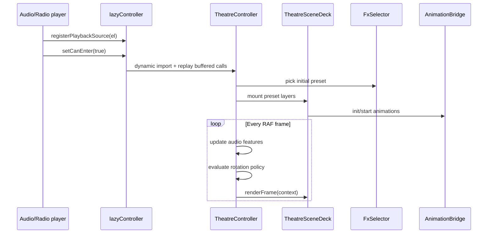

# Theatre Runtime

**Status:** Current  
**Scope:** Platform-owned theatre orchestration — controller, preset rotation, FX selection, overlay timing.  
**For scene authors:** see [`theatre-author-sdk-v1.md`](./theatre-author-sdk-v1.md) and [`adding-theatre-videos-and-animations.md`](./adding-theatre-videos-and-animations.md).

---

## Overview

Theatre mode renders audio-reactive visuals behind the bottom player while playback is active. The runtime is split into:

| Layer | Role |
|-------|------|
| `lazyController.ts` | Lazy-loads the real controller (~200 KB deferred until first use) |
| `TheatreController.ts` | Playback binding, overlay lifecycle, RAF loop, rotation policy |
| `TheatreSceneDeck.ts` | Active/next scene layers, preset transitions |
| `AnimationBridge.ts` | Instantiates `IAnimation` layers from a preset |
| `FxSelector.ts` | Weighted shuffle-bag preset picking |
| `RotationPolicy.ts` | Timed + music-aware auto-rotation windows |
| `registry/` | Scene presets, package registration, tuning constants |

Call sites import `theatreController` from `@/theatre/controller/lazyController`. The lazy façade mirrors the real controller API and replays buffered calls after the dynamic import resolves.

---

## State model

`theatreController.state`:

| Field | Meaning |
|-------|---------|
| `active` | Overlay is mounted and the RAF loop is running |
| `canEnter` | Playback is active — theatre *may* enter background mode |
| `fxEnabled` | User preference from the top-bar toggle |
| `mode` | `'background'` \| `'immersive'` \| `null` |
| `presetId` | Current scene preset |
| `mediaSrc` | Active audio URL |
| `artworkUrl` | Current track artwork |

**`fxEnabled` vs `active`:** the toggle sets `fxEnabled`. When playback is active and `fxEnabled` is true, the controller auto-enters **background** mode. Immersive mode is entered explicitly (e.g. user taps the play-focus hit area). Disabling FX does not require exit→re-enter fighting — `setFxEnabled(false)` tears down visuals cleanly.

---

## Entry and overlay timing

Overlay fade timing lives in `apps/web/src/lib/playbackFocusTiming.ts` under `playbackFocusTiming.theatre`:

| Constant | Default | Used for |
|----------|---------|----------|
| `delayMs` | `0` | Delay before auto-entering background mode |
| `fadeInMs` | `1200` | Overlay opacity fade-in |
| `fadeOutMs` | `3200` | Overlay opacity fade-out |
| `exitBufferMs` | `1200` | Extra wait after fade-out before teardown |

These map to CSS vars via `applyPlaybackFocusTimingCssVars()` in `main.tsx` (`--duration-theatre-fade-in`, etc.).

**This is overlay UI timing only.** It does not control how often FX presets rotate — see [Rotation policy](#rotation-policy) below.

---

## Runtime flow



1. Player providers call `registerPlaybackSource`, `setCanEnter`, `setTrackContext`, and `useTheatreTrackRotation`.
2. When `canEnter && fxEnabled`, controller enters background mode (optionally after `theatre.delayMs`).
3. `FxSelector` picks a weighted preset; `TheatreSceneDeck` crossfades between active and next layers.
4. Single RAF loop updates `shared.time`, `shared.features`, `shared.audio`, evaluates rotation, and calls `deck.renderFrame()`.

---

## Preset rotation

### When rotation happens

| Trigger | Handler |
|---------|---------|
| Auto-rotation timer + audio gate | RAF loop → `RotationPolicy.evaluate()` → `handleRotationPolicyDecision()` |
| Track/segment change | `useTheatreTrackRotation` → `onPlaybackSegmentChanged()` → `rotateRandomPreset()` |
| Manual menu pick | `changePreset(id)` with throttle/cooldown |
| Force after max hold | Policy returns `{ action: 'rotate', reason: 'force' }` |

Auto-rotation is enabled when playback is active (`useTheatreTrackRotation(segmentId, playbackActive, durationMs)`).

### Global defaults

`apps/web/src/theatre/rotation/RotationPolicy.ts`:

```ts
DEFAULT_ROTATION_POLICY_CONFIG = {
  mode: 'timedMusicAware',
  minHoldMs: 45_000,    // minimum time before any rotation
  targetHoldMs: 90_000, // start preloading next preset
  maxHoldMs: 150_000,   // force rotation
  gate: { kind: 'beatOrChaosOrDropEdge' },
}
```

Between `minHoldMs` and `maxHoldMs`, rotation can fire early when the audio gate matches (beat, chaos hit, or drop edge from `TheatreAudioBus`).

### Per-preset overrides

`apps/web/src/theatre/registry/presetTuning.ts` exports hold-window constants attached to individual presets in package `presets.ts` files:

| Constant | min / target / max | Typical use |
|----------|-------------------|-------------|
| `ROTATION_HOLD_DEFAULT` | 5s / 20s / 50s | Fast rotation |
| `ROTATION_HOLD_LAB` | 10s / 60s / 90s | Experimental scenes |
| `ROTATION_HOLD_CALM` | 10s / 30s / 100s | Low-motion backgrounds |
| `ROTATION_HOLD_FLAGSHIP` | 60s / 120s / 180s | Hero canvas scenes |

`resolveRotationPolicy()` in `rotation/rotationOverrides.ts` merges song override → preset override → global default. Preset `rotation.mode: 'perTrack'` pins the current preset for the track duration.

### Preload path

After `targetHoldMs`, policy returns `{ action: 'preload' }`. Controller calls `runPreloadNext()` to prepare the next preset on the deck without switching yet. Actual swap happens on gate or force.

### Manual changes

- `MANUAL_PRESET_THROTTLE_MS` = 100 — debounce rapid menu clicks
- `MANUAL_PRESET_COOLDOWN_MS` = 3000 — suppress auto-rotation briefly after manual pick
- `PRESET_CHANGE_TIMEOUT_MS` = 6000 — guard against hung transitions

---

## FX selection (`FxSelector`)

`apps/web/src/theatre/selection/FxSelector.ts` picks the next preset using a weighted shuffle bag:

- Catalog built from registered packages (`production` vs `lab` category weighting)
- Avoids immediate repeats and recent presets (`FRESH_BAG_AVOID_WINDOW`, `RECENT_PRESET_MEMORY`)
- Respects `?theatrePreset=<id>` URL override in development
- Honors reduced-motion substitution via `reducedMotionPreset` on preset defs
- Skips quarantined presets (`presetQuarantine.ts`)

Song-visual attachments and `attachedOnly` policy can block built-in site presets — see `media/attachedOnlyPlayback.ts` and `media/dynamicPresetStore.ts`.

---

## Scene deck and transitions

`TheatreSceneDeck` manages active + next layer bridges. Transition timings are defined in `THEATRE_TRANSITIONS`:

| Kind | out / in / overlap (ms) |
|------|-------------------------|
| `cut` | 0 / 0 / 0 |
| `fastFade` | 180 / 220 / 80 |
| `crossfade` | 500 / 500 / 500 |
| `slowFade` | 700 / 900 / 300 |
| `dipToBlack` | 350 / 450 / 0 |

Each preset may set `timing.transitionPreference` to choose a kind.

---

## Song visuals and track context

`setTrackContext(track)` hydrates per-track visual media (timeline clips, attached images/videos). When `songVisualPolicy === 'attachedOnly'`, built-in FX rotation is suppressed and timeline clips drive the visual instead.

`onPlaybackSegmentChanged()` also rotates on segment boundaries within a track when not in attached-only mode.

---

## Key files

| Path | Purpose |
|------|---------|
| `controller/lazyController.ts` | Public import, lazy load |
| `controller/TheatreController.ts` | Main orchestrator |
| `controller/TheatreSceneDeck.ts` | Layer stack + transitions |
| `controller/AnimationBridge.ts` | Animation lifecycle |
| `rotation/RotationPolicy.ts` | Hold windows + audio gates |
| `rotation/rotationOverrides.ts` | Preset/song override merge |
| `registry/presetTuning.ts` | `ROTATION_HOLD_*` constants |
| `registry/scenePresets.ts` | Preset definitions |
| `registry/seed.ts` | Package registration |
| `selection/FxSelector.ts` | Weighted bag picker |
| `useTheatreTrackRotation.ts` | Player → controller wiring |
| `components/app-shell/useTheatreMode.ts` | React hook for toggle state |

---

## Related docs

- [`theatre-animations.md`](./theatre-animations.md) — animation authoring, `IAnimation` contract, canvas patterns
- [`theatre-author-sdk-v1.md`](./theatre-author-sdk-v1.md) — public author SDK
- [`playback-focus.md`](./playback-focus.md) — subtitle/focus lane (separate from theatre FX)
- [`theatre-mode-architecture.md`](./theatre-mode-architecture.md) — historical original proposal
