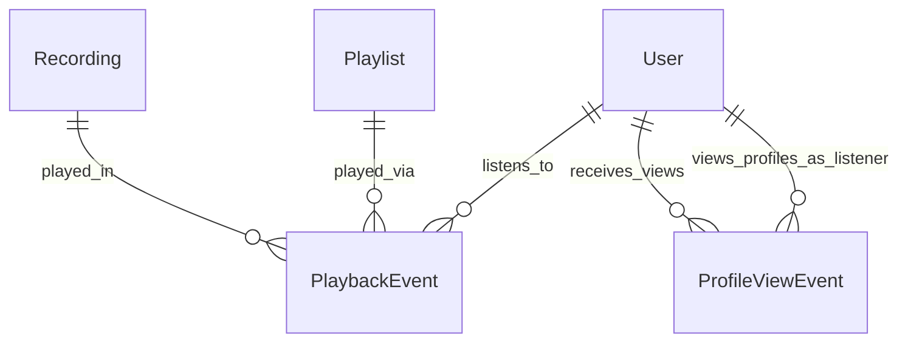
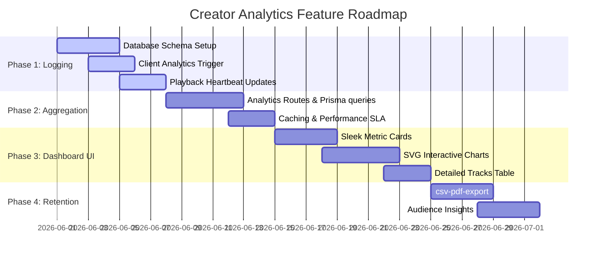

# Roadmap Plan: Playlister Creator Analytics & User Metrics

## 1. Executive Summary & Vision

As part of Playlister’s core differentiation strategy—**focusing on editorial taste, creator-friendly tools, and premium listening journeys**—we aim to launch an epic new feature: **Creator Insights & Analytics**. 

Many audio platforms obscure metrics or hide behind black-box algorithms, leaving creators in the dark about their actual audience. Playlister is building an artist-first ecosystem where professional stats are **completely transparent, beautiful, and actionable**. 

This feature will equip artists with:
*   **Profile Traffic Insights:** Knowing exactly how many page views their public profile gets, which refers to their reach.
*   **Song Performance Analytics:** Knowing which songs are played, how often they are skipped, and the cumulative and average listening durations.
*   **Transparent Metrics:** Empowering artists with deep data to understand their listener behavior, engagement spikes, and geographical or editorial discovery paths.

---

## 2. Core Features & Goals

We want to build a highly premium dashboard inside the **Artist Studio** that displays three primary pillars of metrics:

### 1. Profile Page Views
*   **Total Views:** Cumulative views on the public profile page (`/by-username/:username` or `/member/:userId`).
*   **Trends:** Percentages and graphical representations of page views (Daily, Weekly, Monthly) to show growth.
*   **Traffic Sources (Referrers):** Insight into where views come from:
    *   *Internal:* Homepage featured slots, Editorial picks, Search, or related mixes.
    *   *External:* Direct links, Social media platforms (Twitter, Instagram, YouTube), or custom share cards.

### 2. Song Play Analytics
*   **Detailed Track Performance:** Total plays per song, segmented by date ranges.
*   **Listening Duration:** Cumulative hours/minutes of play time for each track.
*   **Completion Rate:** A clear visual of play completion—how many plays reached 100% vs. how many were skipped within the first 30 seconds.
*   **Session Contexts:** Breakdown of whether tracks were played via a curated playlist, an album, the search results page, or a direct link.

### 3. Professional Transparency Dashboard
*   **Real-time Insights:** Heartbeat tracker indicating current active plays or recent activity spikes.
*   **Sleek Data Visualization:** Premium, glassmorphic charts leveraging curated, HSL-tailored color schemes, keeping layouts consistent with Playlister's dark, immersive audio aesthetics.

---

## 3. Database Architecture (Prisma Schema Updates)

We will leverage the existing `PlaybackEvent` model and add a new `ProfileViewEvent` model to capture page traffic without compromising page load speeds.



### New Model: `ProfileViewEvent`
To record profile hits safely, we will create a lightweight `ProfileViewEvent` table:

```prisma
model ProfileViewEvent {
  id            BigInt   @id @default(autoincrement()) @db.UnsignedBigInt
  profileUserId String   @db.VarChar(191) // The artist whose page was viewed
  viewerId      String?  @db.VarChar(191) // Optional: Logged-in viewer's user ID
  referrer      String?  @db.VarChar(255) // Source context (e.g., 'homepage', 'search', 'direct', 'twitter')
  deviceType    String?  @db.VarChar(50)  // Mobile, Desktop, Tablet
  createdAt     DateTime @default(now())

  // Relations
  profileUser   User     @relation("ProfileViews", fields: [profileUserId], references: [id], onDelete: Cascade)
  viewer        User?    @relation("ViewerActivities", fields: [viewerId], references: [id], onDelete: SetNull)

  @@index([profileUserId, createdAt])
  @@index([referrer])
}
```

### Updates to `User` Model
```prisma
model User {
  // ... existing fields ...
  receivedProfileViews ProfileViewEvent[] @relation("ProfileViews")
  viewedProfiles       ProfileViewEvent[] @relation("ViewerActivities")
}
```

---

## 4. API Endpoint Specifications

The backend will expose an OpenAPI-compliant analytics router under `/api/me/analytics` with robust caching and time-range filtering.

### 1. `GET /api/me/analytics/summary`
Returns high-level metric cards for the dashboard.
*   **Query Params:** `range` (`24h`, `7d`, `30d`, `all_time`)
*   **Response Status:** `200 OK`
*   **Response Body:**
```json
{
  "summary": {
    "totalPageViews": {
      "current": 1420,
      "previous": 1250,
      "changePercentage": 13.6
    },
    "totalPlays": {
      "current": 8420,
      "previous": 7900,
      "changePercentage": 6.58
    },
    "totalPlayTimeSeconds": {
      "current": 1515600,
      "previous": 1380000,
      "changePercentage": 9.83
    },
    "averageCompletionRate": {
      "current": 72.4,
      "previous": 68.1,
      "changePercentage": 6.31
    }
  }
}
```

### 2. `GET /api/me/analytics/time-series`
Returns data points for time-series charts (Profile Views & Play Durations).
*   **Query Params:** `range` (`24h`, `7d`, `30d`), `metric` (`views`, `plays`, `playTime`)
*   **Response Body:**
```json
{
  "metric": "views",
  "range": "7d",
  "dataPoints": [
    { "timestamp": "2026-05-22T00:00:00Z", "value": 180 },
    { "timestamp": "2026-05-23T00:00:00Z", "value": 210 },
    { "timestamp": "2026-05-24T00:00:00Z", "value": 195 },
    { "timestamp": "2026-05-25T00:00:00Z", "value": 240 },
    { "timestamp": "2026-05-26T00:00:00Z", "value": 310 },
    { "timestamp": "2026-05-27T00:00:00Z", "value": 285 },
    { "timestamp": "2026-05-28T00:00:00Z", "value": 315 }
  ]
}
```

### 3. `GET /api/me/analytics/recordings`
Returns detailed performance tabular data per song.
*   **Query Params:** `range` (`24h`, `7d`, `30d`), `sortBy` (`plays`, `duration`, `completion`), `order` (`asc`, `desc`), `page`, `pageSize`
*   **Response Body:**
```json
{
  "data": [
    {
      "recordingId": "rec_id_101",
      "title": "Lost in the Grid",
      "artworkUrl": "/uploads/art/lost_in_grid.jpg",
      "durationSeconds": 245,
      "totalPlays": 3120,
      "totalPlayTimeMinutes": 11500,
      "uniqueListeners": 1890,
      "completionRate": 78.5,
      "playCountTrend": 12.3
    }
  ],
  "meta": { "page": 1, "pageSize": 10, "total": 12 }
}
```

---

## 5. UI/UX & High-Fidelity Design Direction

We want to design a premium, dark-mode analytics studio that matches the rest of the application but feels like a high-end dashboard. Let's details the custom style guidelines and components:

### 1. Color Palette & Dark Immersive Theme
*   **Canvas Background:** Sleek, deep metallic-navy `#0a0d13`
*   **Surface Cards:** Glossmorphic semitransparent charcoal `#121721` with `backdrop-filter: blur(12px)`
*   **Borders:** Soft translucent white-slate `rgba(255, 255, 255, 0.08)`
*   **HSL Neon Accents:**
    *   *Page Views:* Cyan/Ice-Blue `#06b6d4`
    *   *Plays & Activity:* Mint/Teal `#10b981`
    *   *Play Time:* Bright Orchid/Indigo `#8b5cf6`
    *   *Completion & Engagement:* Vivid Coral/Rose `#f43f5e`

### 2. Layout Structure (Three Columns/Grid Sections)
1.  **Top Metrics Bar:** Four interactive KPI cards showing profile views, plays, hours listend, and average completion. Cards will feature micro-animations on hover (subtle neon borders + glow).
2.  **Primary Chart Area:** A togglable tab structure displaying either the **Profile Views Trend** or the **Listening Duration Trend** using smooth SVG vector paths and interactive tooltips.
3.  **Performances Grid:** A data list highlighting individual track stats with radial progress meters indicating each song's play-completion rates.

---

## 6. Phased Implementation Roadmap

To deliver this epic feature safely and with extreme stability, we will execute it across four structured phases:



### Phase 1: Database & Event Logging (Week 1)
*   **Objective:** Set up robust data collection models without breaking existing system structures or increasing page loads.
*   **Key Deliverables:**
    *   Apply the Prisma schema migration adding `ProfileViewEvent` table.
    *   Create a backend tracking middleware: Whenever a user hits `/api/users/by-username/:username` or `/api/users/:userId`, record the `ProfileViewEvent` asynchronously in a non-blocking queue.
    *   Upgrade the frontend media player's progress heartbeats: Emit accurate `playedSeconds` updates to `/api/me/playback-events` when tracks pause or complete, guaranteeing the accuracy of "Time Listened".

### Phase 2: High-Performance Aggregation API (Week 2)
*   **Objective:** Develop the aggregation API endpoints, making them highly responsive (query times < 100ms).
*   **Key Deliverables:**
    *   Write optimized SQL aggregation queries using Prisma Group-By to collect daily and weekly trends.
    *   Implement Redis or key-based caching on the summary analytics endpoint, so querying huge play histories doesn't stress the primary database server.
    *   Thoroughly document the new Swagger openapi specs and run openapi compilation tests.

### Phase 3: Studio Insights Frontend (Week 3)
*   **Objective:** Design and assemble the premium analytics page in the Artist Studio using rich aesthetics.
*   **Key Deliverables:**
    *   Implement the `/studio/analytics` route in React Router.
    *   Develop the metric cards using Tailwind CSS 4 card structures and custom HSL gradients.
    *   Create smooth, responsive **SVG Sparklines and Chart Components** to display timeseries data dynamically.
    *   Construct the track-by-track list complete with sorting, pagination, and a radial index indicating completion percentages.

### Phase 4: Exportable Stats & Advanced Retention Insights (Week 4)
*   **Objective:** Deliver professional-grade analytics options for artists and DJs.
*   **Key Deliverables:**
    *   Add a **CSV/Excel Export** feature to let artists analyze play numbers offline.
    *   Incorporate an **Audience Engagement Heatmap** illustrating which parts of their tracks are listened to vs skipped, making it highly transparent where listeners drop off.

---

## 7. Verification & Quality Assurance Plan

### Automated Testing
*   **API Load Tests:** Validate that recording thousands of asynchronous play/page views doesn't bottleneck database execution. Limit route overhead to under 50ms.
*   **Prisma Aggregation Assertions:** Integrate unit tests verifying that sum logic computes accurately (`playedSeconds` translates to correct decimal hours).
*   **OpenAPI Compliance:** Validate backend payloads automatically against standard Swagger schemas using `express-openapi-validator`.

### Manual Testing
*   **Multi-Device Simulation:** Test dashboard rendering across mobile screens (iPhone/Android layouts) and widescreen monitors.
*   **End-to-End Simulation:** Play a seed track for exactly 45 seconds, then verify the artist studio immediately increments plays, total time, and the average completion percentage.
